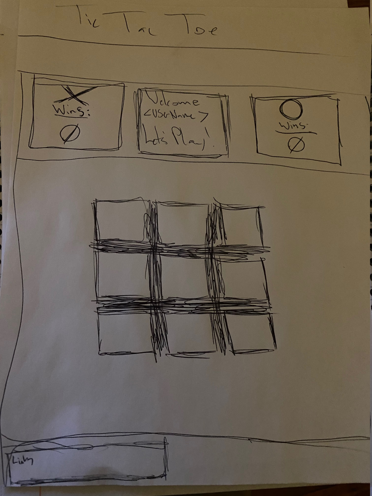

# Welcome to my Tic Tac Toe Game!!

For This application I used the following technologies:
* HTML 
* CSS
* JavaScript
* Jquery
* AJAX

---
# Wireframe for application:



---
# User Stories for this project
   * As a user I want to be able to create an account so that I can sign in and keep my game data saved.

   * As a User I want to be be able to sign out of my profile so that my information will be secure.

   * As a User I would like to be able to see how many games I have played so that I can keep track of my usage.

   * As a User I would like all interaction with the game disabled after a win and the winner displayed so that there isnt a chance of changing a win.

# Development

```md
    The first thing I needed was to setup the html file with input forms and work out calling the api and user authorization with the api. After succefully completion of the user authorization functionality It was time to put together the game logic.
        After creating a grid of boxes for the game board, the next step was to figure out exactly how to track user moves and check for a winner. I finally landed on adding a class of either X or O, as a child, to each box click dependent on the turn. All of the boxes in the grid were given classes that target specific rows, columns, and diagonal rows in the grid. Once one of those clases reaches a length of 3 X's or O's a winner is declared. If the combined total of X's and O's in the class of box equals nine a tie is declared.
    Since this is a single page application and a game, I wanted to style my application much like a video game. I wanted each screen of the application to remain hidden until called by a click event.So, every layer of functionality should have its own screen.

```

 # Future updates:
 * 

